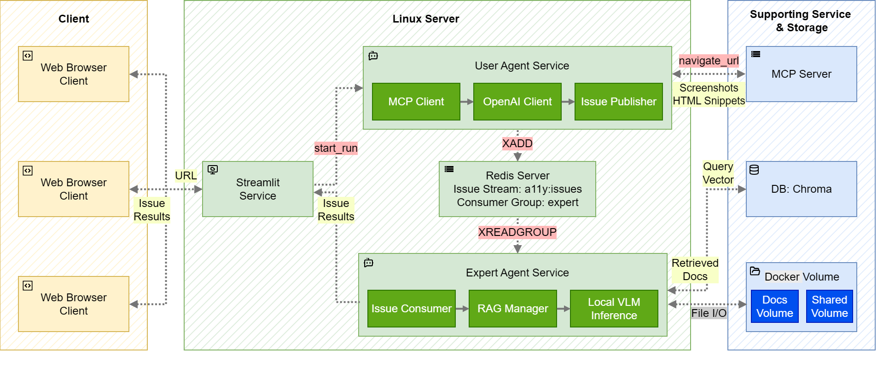
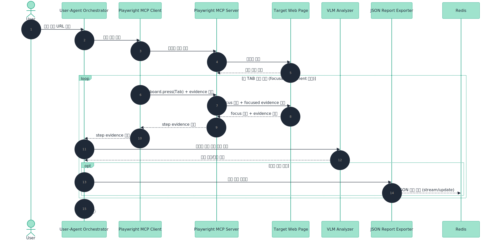
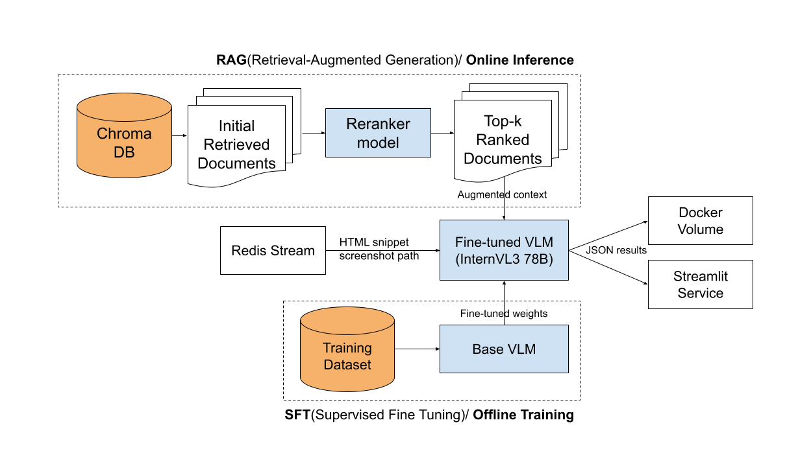

# Multi Agent: 사용자 여정 및 전문가 맥락 기반 웹 접근성 자동 진단

이 프로젝트는 정적 HTML 규칙 검사에 머무르는 기존 자동화 접근성 도구의 한계를 넘어서, 실제 웹페이지와 상호작용하며 발생하는 사용자 여정 기반 이슈를 수집하고 전문가 맥락으로 정밀 판정하는 멀티 에이전트 진단 파이프라인입니다.

## 프로젝트 배경
웹 접근성 진단은 장애인 사용자도 불편 없이 서비스를 이용할 수 있게 만드는 과정이지만, 실제 서비스에서는 화면 상태 변화, 동적 컴포넌트, 맥락 의존 판단 때문에 단순 규칙 검사만으로는 정확도가 잘 나오지 않습니다. 기존 자동 도구는 정적 DOM 스캔 위주라 실제 사용자 여정에서 발생하는 문제를 놓치기 쉽고, 지침 적용도 맥락 추론이 필요해 전문가 판단이 병목이 됩니다.

그래서 이 프로젝트는 다음을 목표로 합니다.
- 실제 키보드 사용자 흐름을 재현해서 동적 접근성 이슈를 증거로 수집
- 수집된 증거를 바탕으로, 전문가 수준의 맥락 추론을 적용해 정밀 진단
- 에이전트 간 비동기 통신과 산출물 공유를 Docker Compose로 표준화

## 전체 구조
아래는 전체 시스템 아키텍처입니다. User Agent가 MCP 기반 브라우저 상호작용으로 초기 이슈를 탐지하고, Expert Agent가 QLoRA 및 Multimodal RAG 기반으로 정밀 진단을 수행합니다. Redis는 에이전트 간 비동기 이벤트 전달에 사용되고, 진단 증거와 결과는 공유 볼륨에 저장됩니다.



### 데이터 흐름 요약
1. 사용자가 진단 대상 URL을 전달
2. User Agent가 Playwright MCP를 통해 TAB 기반 키보드 순회를 수행
3. 각 포커스 단계에서 스크린샷, HTML 스니펫, 포커스 경로 등 증거를 저장
4. 위반 의심 이슈만 Redis Streams로 이벤트 발행
5. Expert Agent가 이벤트를 소비하고 공유 볼륨의 증거를 읽어 정밀 판정
6. 최종 진단 결과를 구조화된 JSON으로 저장

## 에이전트 구성과 동작

### Orchestrator
- 실행 흐름을 제어하고, MCP 클라이언트 호출 및 에이전트 파이프라인을 연결합니다.
- User Agent 실행과 Redis 이벤트 발행을 트리거하는 역할로 이해하면 됩니다.

### User Agent
실제 키보드 사용자처럼 페이지를 탐색하며 동적 접근성 이슈를 초기 진단합니다.
- TAB 키 기반 순회로 포커스 이동 흐름을 재현
- 각 단계에서 focused screenshot, element HTML snippet, focus path를 수집
- 수집 증거를 기반으로 지침 위반 가능성을 1차 판정
- 의심 이슈만 Redis Streams로 비동기 전송

### Expert Agent
User Agent가 보낸 의심 이슈를 전문가 맥락으로 정밀 진단합니다.
- (RAG) 유사 진단 사례를 참고하기 위해 HyDE와 reranking을 적용한 Multimodal RAG 활용
- (SFT/QLoRA) 전문가 수준 판정을 위해 파인튜닝된 VLM을 활용
- (Inference) 이슈 난이도에 따라 추론 강도를 조절하는 방식으로 최종 판정을 생성

## 트러블슈팅

프로젝트 진행 중 실제로 겪었던 핵심 트러블슈팅 사례를 User Agent와 Expert Agent 기준으로 정리했습니다.

### User Agent

#### 1. 진단 속도 및 정확도 향상을 위한 Multi-Agent 병렬 처리 구조 도입
- **문제 상황**
  - User Agent가 페이지를 훑으며 초기 진단을 내리는 데 약 40분이 소요됨
  - 진단 정확도가 낮아 실제 오류인 접근성 항목을 누락하는 경우가 빈번함
- **원인 파악**
  - 하나의 Agent가 모든 접근성 지침을 한 번에 진단하도록 설계되어 처리 시간이 길어짐
  - 전체 지침을 다루기 위해 경량 모델을 사용했지만, 방대한 context를 복합적으로 판단하기에는 한계가 있었음
- **해결 방법**
  - 지침별로 Agent를 분리해 각 Agent가 하나의 지침만 판단하도록 변경
  - 지침 기준에 맞춰 병렬 진단을 수행하도록 구조를 재설계
  - 각 Agent의 가용 context window 안에 진단 예시를 추가해 정확도를 보강
- **결과**
  - 초기 진단 시간 40분 → 약 10분으로 단축
  - 지침별 진단 정확도 30% 개선
  - 지침별 디버깅과 튜닝이 쉬워짐

#### 2. Docker Compose 기반 AI Agent 네트워크 안정화
- **문제 상황**
  - Redis 연결 실패
  - MCP 세션 생성 실패
  - 에이전트 간 이벤트 전달 불가
  - 환경 설정을 수정한 뒤에도 API 인증 오류가 발생
- **원인 파악**
  - Docker 환경에서도 로컬 실행과 동일하게 `localhost` 중심으로 네트워크를 설정해 컨테이너 간 통신이 깨짐
  - MCP 서버에서 403 에러가 발생
  - `.env` 파일을 `export KEY=value` 형태로 작성해 환경변수가 정상 주입되지 않음
- **해결 방법**
  - Redis 및 MCP 접근 주소를 `localhost`가 아닌 Compose 서비스 이름 기반으로 수정
  - MCP 서버 설정에 `--allowed-hosts` 옵션을 적용
  - `.env`를 `KEY=value` 형식으로 정정하고 컨테이너를 재빌드
- **결과**
  - 컨테이너 기반 서비스 간 통신 구조를 표준화
  - 인증 및 환경 설정 오류를 해결
  - 이후 에이전트 구조 확장에 유리한 배포 기반을 확보

### Expert Agent

#### 3. 가드레일을 통한 학습데이터 품질 향상
- **문제 상황**
  - 학습 이후 모델의 추론 길이가 과도하게 길어져 응답 속도가 느려짐
  - 응답에 부정확하거나 불필요한 내용이 포함되어 필요한 정보를 추출하는 데 시간이 추가로 듦
- **원인 파악**
  - 학습데이터 제작용 AI에 추론을 과도하게 강제하면서 의미 없고 반복적인 추론이 다수 포함됨
  - 진단에 필요한 추론 단계를 프롬프트에 구조적으로 정의하지 않아 잘못된 추론 내용이 데이터에 섞임
- **해결 방법**
  - 진단 난이도에 따라 추론 길이를 Adaptive하게 조정하도록 지시
  - 전문가와 함께 필수 추론 단계인 `웹페이지 목적 파악 → 해당 컴포넌트의 기능 파악 → 맥락을 반영한 진단`을 정의
- **결과**
  - 평균 추론 길이 35% 감소
  - 진단 정확도 20% 향상
  - 모델이 전문가 판단 구조에 더 가까운 패턴으로 수렴

#### 4. 멀티모달 학습 입력 구조 통일을 통한 학습 안정화
- **문제 상황**
  - 멀티모달 학습데이터 학습 중 런타임 에러가 발생
  - 멀티모달 데이터 학습이 전반적으로 불안정하게 진행됨
- **원인 파악**
  - 텍스트 전용 샘플과 멀티모달 샘플을 분리하지 않고 배치화해 input schema 불일치가 발생
  - 텍스트만 있는 학습데이터에도 `<image>` placeholder가 남아 있어 이미지 임베딩이 잘못 매핑됨
- **해결 방법**
  - Collator에서 이미지 포함 샘플을 배치 앞쪽으로 재정렬해 image feature 매핑이 순차적으로 이뤄지도록 구조를 단순화
  - 이미지가 없는 샘플에서는 `<image>` placeholder를 제거해, 이미지 토큰이 있을 때만 실제 image tensor가 함께 입력되도록 수정
- **결과**
  - Input schema 불일치를 해소
  - 학습 곡선이 안정적으로 수렴

#### 5. HyDE/Reranking 기반 RAG 검색 정밀도 고도화
- **문제 상황**
  - RAG 검색 정확도가 낮음
  - 유사하지만 실제 진단에는 필요 없는 이력이 과도하게 검색됨
- **원인 파악**
  - 검색 프롬프트가 User Agent의 초기 진단 결과에만 의존해 검색용 컨텍스트가 부족했음
  - Dense retrieval은 의미적으로 유사한 문서를 넓게 수집해 실제 필요한 이력을 정밀하게 골라내는 데 한계가 있었음
- **해결 방법**
  - HyDE 단계에서 User Agent 결과뿐 아니라 Expert Agent의 초기 진단까지 활용해 검색 컨텍스트를 확장
  - 1차 검색 결과에 대해 reranking을 적용해 실제 진단에 도움이 되는 사례를 상위로 재배치
- **결과**
  - 관련 사례 상위 노출률 30% 증가
  - 모델 응답 정확도 15% 향상

## 접근성 지침(예시)
아래는 User Agent가 초기 진단에서 참고하는 지침 예시입니다.
- 6.1.2 초점 이동과 표시
- 5.3.2 콘텐츠의 선형 구조
- 6.5.3 레이블과 네임
- 5.1.1 적절한 대체 텍스트 제공

## 실행 방법

### 1) 환경 변수 설정
`.env.example`을 복사한 뒤, `nano`로 `.env`를 열어서 API Key 등을 입력합니다.

```bash
cp .env.example .env
nano .env
```

예시
```bash
OPENAI_API_KEY=YOUR_KEY
TARGET_URL=https://www.example.com
```

### 2) Docker Compose 실행

```bash
docker compose up --build
```

- `user_agent`는 `TARGET_URL`을 기준으로 진단을 수행하고, 결과와 증거를 `/shared/out`에 저장합니다.
- `expert_agent`는 Redis Streams(`a11y:issues`)를 소비하면서 `/shared/out`의 증거를 읽어 정밀 진단 결과를 생성합니다.

### 3) 종료 및 정리

```bash
docker compose down -v
```

## 결과 저장 방식
결과는 컨테이너 내부 기준으로 `/shared/out`에 저장되며, 일반적으로 docker-compose에서 host 디렉터리나 named volume으로 마운트됩니다.

### 산출물 예시
User Agent는 탐색 스텝 단위의 증거를 남깁니다.

```text
out/
 ├─ step_001.png
 ├─ step_001.html
 ├─ step_002.png
 ├─ step_002.html
 └─ focus_path.json
```

Expert Agent는 Redis로 전달된 이슈를 기준으로, 동일한 실행 결과 폴더에 정밀 진단 결과를 JSON 형태로 추가 저장합니다(파일명과 스키마는 구현에 따라 다를 수 있습니다).

## 참고: User Agent 프로세스 다이어그램



## 참고: Expert Agent 시스템 아키텍처


